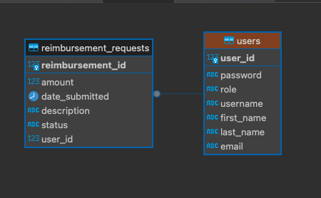

Employee Reimbursement System (ERS)

Welcome to the Employee Reimbursement System (ERS) repository! This project is a Java Full Stack application designed to streamline the process of submitting and managing reimbursement requests for employees.

## Overview

The ERS application consists of two main components:
- **Frontend**: Built with React, the frontend provides an intuitive user interface for employees and managers to interact with the reimbursement system.
- **Backend**: Developed with Spring Boot, the backend handles business logic, data management, and communication with the frontend.

## Features

### Employee Features
- **Account Creation**: Employees can create an account to access the system.
- **Reimbursement Submission**: Employees can submit reimbursement requests.
- **View Reimbursements**: Employees can view their own reimbursement tickets and pending reimbursement tickets.

### Manager Features
- **View Reimbursements**: Managers can view all reimbursements.
- **Resolve Reimbursements**: Managers can approve or deny reimbursement requests.
- **User Management**: Managers can view all users and delete users (with related reimbursements).

### Validation
- **User Authentication**: Only logged-in users can access functionalities.

### Optional Features
- **Service Layer Logging**: Logging of service layer with logback.
- **Service Layer Testing**: Test suites for the service layer with JUnit.

## Database Architecture

The database architecture includes tables for users, reimbursements, and other necessary entities. Customize table columns and constraints as needed, ensuring proper error handling.

## Requirements

For detailed project requirements, please refer to [Project Requirements](requirements.md).

## Getting Started

To get started with the ERS application, follow these steps:

1. Clone the repository to your local machine.
2. Set up the backend:
   - Navigate to the `ERSBackend` directory.
   - Build and run the Spring Boot application.
3. Set up the frontend:
   - Navigate to the `ERSFrontend` directory.
   - Install dependencies with `npm install`.
   - Start the React development server with `npm start`.
4. Access the application in your web browser at `http://localhost:3000`.

## License

This project is licensed under the [MIT License](https://opensource.org/license/mit).
