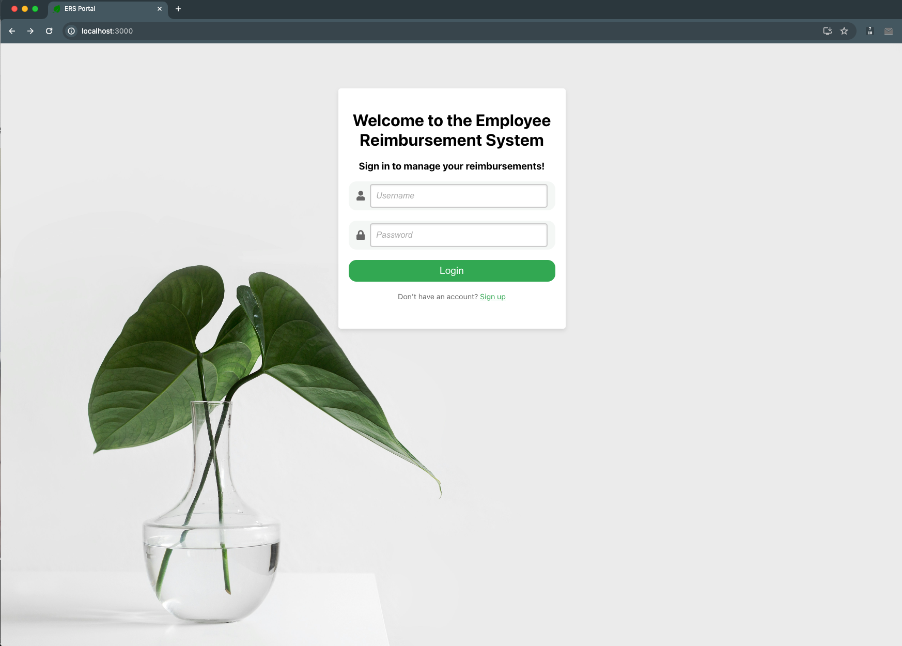

Employee Reimbursement System (ERS)

Welcome to the Employee Reimbursement System (ERS) repository! This project is a Java Full Stack application designed to streamline the process of submitting and managing reimbursement requests for employees. By simplifying this process, ERS aims to reduce administrative overhead, increase transparency in financial operations, and enhance the overall employee experience in managing expenses.

## Overview

The ERS application consists of two main components:
- **Frontend**: Built with React, the frontend provides an intuitive user interface for employees and managers to interact with the reimbursement system.
- **Backend**: Developed with Spring Boot, the backend handles business logic, data management, and communication with the frontend.

## Features

### Employee Features
- **Account Creation**: Employees can create an account to access the system.
- **Reimbursement Submission**: Employees can submit reimbursement requests.
- **View Reimbursements**: Employees can view their own reimbursement tickets and pending reimbursement tickets.

### Manager Features
- **View Reimbursements**: Managers can view all reimbursements.
- **Resolve Reimbursements**: Managers can approve or deny reimbursement requests.
- **User Management**: Managers can view all users and delete users (with related reimbursements).

### Validation
- **User Authentication**: The system ensures that only logged-in users can access functionalities. Using Spring Security, the backend manages sessions and authentication states securely. Each request is verified to ensure that it comes from an authenticated session before any user-specific actions are processed. In case of session expiration or non-authentication, the system redirects users to the login page.

### Integration of Frontend and Backend
- **API Communication**: The frontend uses Axios to make HTTP requests to the backend. These requests include credentials where necessary, and the backend uses session cookies to maintain user state across requests.
- **Secure Data Flow**: The communication between the frontend and the backend is secured through HTTPS, ensuring that all data transferred remains encrypted and secure from interceptors.
- **Frontend Authentication Checks**: The frontend has mechanisms to check whether the user is logged in before rendering protected routes. It interacts with the backend to fetch authentication status and user details, which are then stored in the global context or local storage for quick access and to manage user sessions effectively.
- **Error Handling and User Feedback**: Both frontend and backend include robust error handling mechanisms to deal with authentication errors, such as unauthorized access attempts or session timeouts. Users are promptly informed with appropriate messages guiding them to re-authenticate or correct their actions.

## Technology Stack
- **Frontend**: React, Axios for API calls
- **Backend**: Spring Boot with Spring Security for secure API endpoints, Spring Data JPA for database interactions
- **Database**: PostgreSQL

## Database Architecture

The database architecture includes tables for users, reimbursements, and other necessary entities. Customize table columns and constraints as needed, ensuring proper error handling.

## Requirements

For detailed project requirements, please refer to [Project Requirements](requirements.md).

## Getting Started

To get started with the ERS application, follow these steps:

1. Clone the repository to your local machine.
2. Set up the backend:
   - Navigate to the `ERSBackend` directory.
   - Build and run the Spring Boot application.
3. Set up the frontend:
   - Navigate to the `ERSFrontend` directory.
   - Install dependencies with `npm install`.
   - Start the React development server with `npm start`.
4. Access the application in your web browser at `http://localhost:3000`.

## License

This project is licensed under the [MIT License](https://opensource.org/license/mit).
